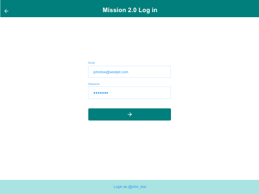
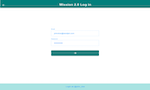

# iOS Application Vision

  

TODO add A brief info of iOS application Vision project.

_Read this in other languages: [English](README.md)._

## Contents

- [iOS Application Vision](#ios-application-vision)
  - [Contents](#contents)
  - [Short description](#short-description)
    - [What's the problem?](#whats-the-problem)
    - [How can technology help?](#how-can-technology-help)
    - [The idea](#the-idea)
  - [Demo video](#demo-video)
  - [The architecture](#the-architecture)
  - [Details description](#details-description)
  - [Project roadmap](#project-roadmap)
  - [Getting started](#getting-started)
  - [Package Dependencies](#package-dependencies)
  - [Contributing](#contributing)
  - [Versioning](#versioning)
  - [Developers](#developers)
  - [License](#license)
  - [Acknowledgments](#acknowledgments)

## Short description

### What's the problem?

TODO add problem overview.

### How can technology help?

TODO add iPad can help.

### The idea

It's imperative that learning and creating can continue when educational institutions have to shift the way they teach in times of crises, such as the COVID-19 pandemic. Providing a set of open source tools, backed by IBM Cloud and Watson Services, will enable educators to more easily make content available for their students.

## Demo video

## The architecture

1. The user navigates to the site and uploads a video file.
2. Watson Speech to Text processes the audio and extracts the text.
3. Watson Translation (optionally) can translate the text to the desired language.
4. The app stores the translated text as a document within Object Storage.

## Details description

[More detail is available here](./docs/DESCRIPTION.md)

## Project roadmap

The project currently does the following things.

- Feature 1
- Feature 2
- Feature 3

## Getting started

In this section you add the instructions to run your project on your local machine for development and testing purposes. You can also add instructions on how to deploy the project in production.

- [sample-todo](./docs/)
- [sample-todo](./docs/)
- [sample-todo](./docs/)

## Package Dependencies

- [realm.io](https://realm.io) - The Realm’s mobile database
- [SnapshotTesting](https://github.com/pointfreeco/swift-snapshot-testing) - The SnapshotTesting module
- [ViewInspector](https://github.com/nalexn/ViewInspector) - The ViewInspector library for unit testing SwiftUI views

## Contributing

Please read [CONTRIBUTING.md](./docs/CONTRIBUTING.md) for details on our code of conduct, and the process for submitting pull requests to us.

## Versioning

We use [SemVer](http://semver.org/) for versioning. For the versions available, see the [tags on this repository](./README.md).

## Developers

- **Amir Hatami** - _Initial work_ - [amir-hatami](https://www.linkedin.com/in/amir-hatami-174aba57/)
- **Tom Schulz** - _Initial work_ - [tom-schulz](https://www.linkedin.com/in/tom-schulz-2158229/)

## License

This project is licensed under TODO License - see the [LICENSE](./docs/LICENSE.md) file for details.

## Acknowledgments

- Based on [Amir Hatami's README template](https://github.com/amhatami).
