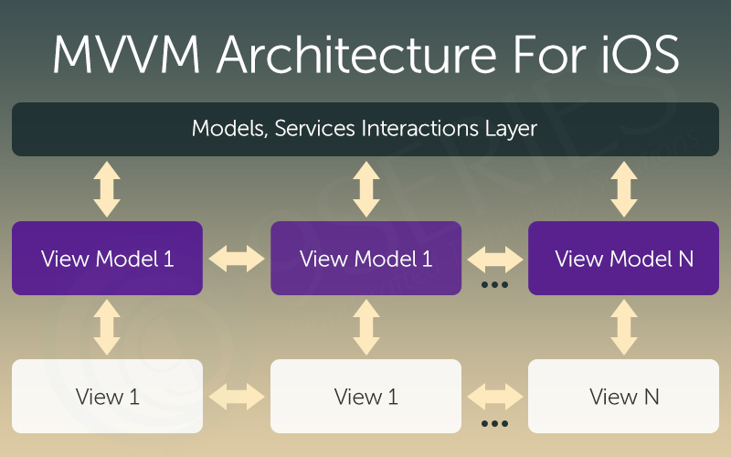
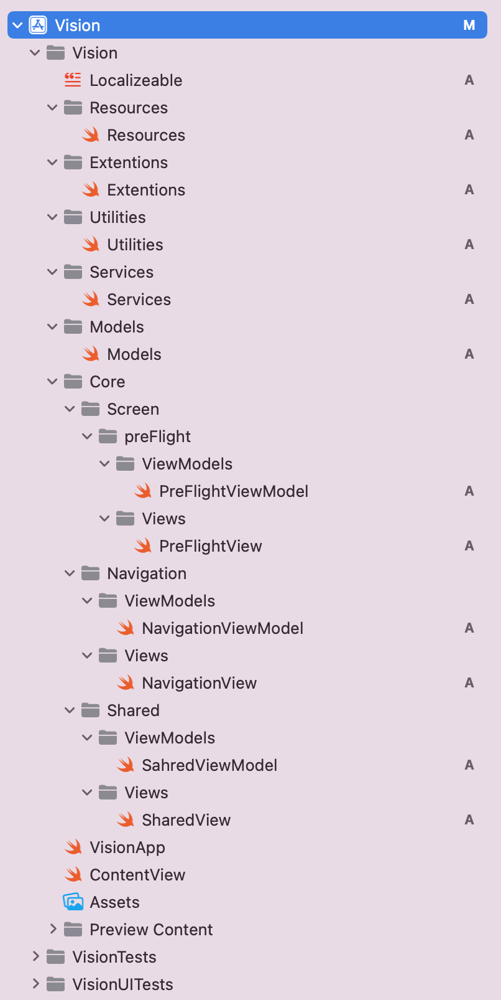
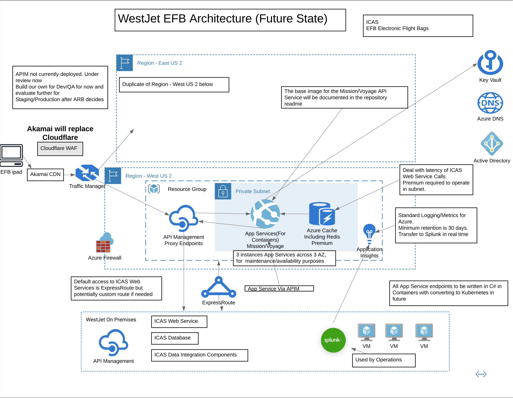
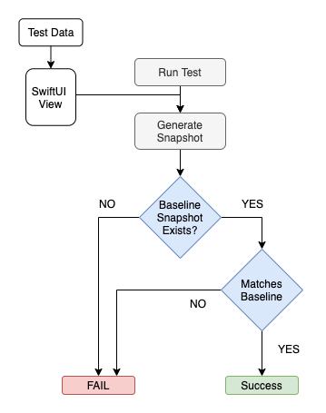

# iOS Application - Vision

  

TODO add A brief info of iOS application Vision project.

_Read this in other languages: [English](README.md)._

## Contents

- [iOS Application - Vision](#ios-application---vision)
  - [Contents](#contents)
  - [Short description](#short-description)
    - [What's the problem?](#whats-the-problem)
    - [How can technology help?](#how-can-technology-help)
    - [The idea](#the-idea)
  - [The architecture](#the-architecture)
  - [Details description](#details-description)
  - [Project roadmap](#project-roadmap)
  - [Getting started](#getting-started)
  - [Package Dependencies](#package-dependencies)
  - [Contributing](#contributing)
  - [Versioning](#versioning)
  - [Developers](#developers)
  - [License](#license)
  - [Acknowledgments](#acknowledgments)

## Short description

### What's the problem?

TODO add problem overview.

### How can technology help?

TODO add how iPad can help.

### The idea

TODO add the idea.

## The architecture

**The separate code layers of MVVM are:**
- **Model:** This layer is responsible for the abstraction of the data sources. Model and ViewModel work together to get and save the data.
- **View:** The purpose of this layer is to inform the ViewModel about the user’s action. This layer observes the ViewModel and does not contain any kind of application logic.
- **ViewModel:** It exposes those data streams which are relevant to the View. Moreover, it servers as a link between the Model and the View.

## The folder structurs

Organizing Source Files using groups, annotations, and Quick Help to improve the project’s maintainability.

## Details description

1. The user navigates to the app and sign in.
2. The user can select a flight from flights list.
3. ...

[More detail is available here](./docs/DESCRIPTION.md)

## Project roadmap

The project currently does the following features.

- Feature 1
- Feature 2
- Feature 3

## Getting started

In this section we will add the instructions to run this project on local device for development and testing purposes. we can also add instructions on how to deploy the project in production.

- [sample-todo](./docs/)
- [sample-todo](./docs/)
- [sample-todo](./docs/)

## Package Dependencies

Integrate package dependencies to share code between projects, or leverage code from other developers.

- [Package Dependencies](https://developer.apple.com/documentation/swift_packages/adding_package_dependencies_to_your_app) - Adding Package Dependencies to Your App
- [Realm.io](https://realm.io) - The Realm’s mobile database
- [SnapshotTesting](https://github.com/pointfreeco/swift-snapshot-testing) - The SnapshotTesting module
- [ViewInspector](https://github.com/nalexn/ViewInspector) - The ViewInspector library for unit testing SwiftUI views

## Contributing

Please read [CONTRIBUTING.md](./docs/CONTRIBUTING.md) for details on our code of conduct, and the process for submitting pull requests to us.

## Versioning

We use [SemVer](http://semver.org/) for versioning. For the versions available, see the [tags on this repository](./README.md).

## Developers

- **Tom Schulz** - _Sr. Software Development Engineer - Mobile_ - [tom-schulz](https://www.linkedin.com/in/tom-schulz-2158229/)
- **Amir Hatami** - _Sr. Software Development Engineer - Mobile_ - [amir-hatami](https://www.linkedin.com/in/amir-hatami-174aba57/)

## License

This project is licensed under TODO License - see the [LICENSE](./docs/LICENSE.md) file for details.

## Acknowledgments

- Based on [Amir Hatami's README template](https://github.com/amhatami).
